# Домашнее задание №4 к 12.12.

## Задание. 
---

Взять приложение из п.3 (или любое другое), автоматизировать его сборку в Jenkins (pipeline и freestyle Job) на событие pull-request/push.
В pipeline должны входить:
- сборка приложения (maven, другой сборщик)
- запуск автотестов (unit в зависимости от проекта, postman)
- сборка результатов работы тестов в allure и отброска в Jenkins
- анализ исходного кода Sonar (в том числе необходимо исправить все ошибки и (добиться не менее 90% покрытия кода тестами)* зависит от проекта)
- деплой приложения через Ansible (из лаб №2) или сборка контейнера (т.е. отказ от ансибл)

Для сдачи лабы прислать код pipeline (скриншоты) или продемонстрировать экран с работой джобов
---

## Решение.

С помощью `docker-compose up -d` поднял локально инстансы Jenkins и Sonarqube, настроил каждый.

Поставил необходимые плагины - Docker, Allure, Sonarqube.
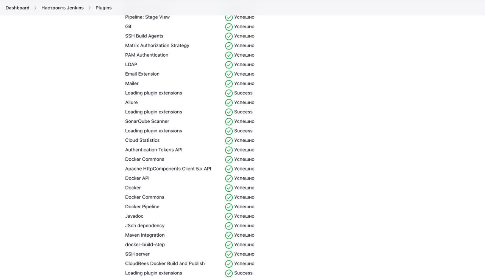

В директории `app/` лежит приложение, которое собиралось.

Настройки Docker в Jenkins.
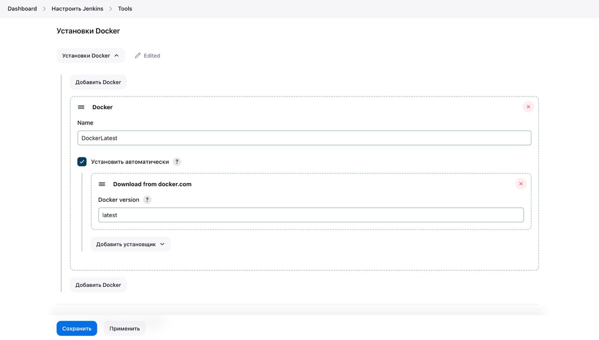

Настройки Maven в Jenkins.
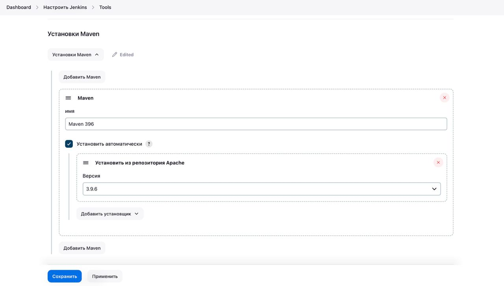

Настройки Sonarqube Scanner в Jenkins.
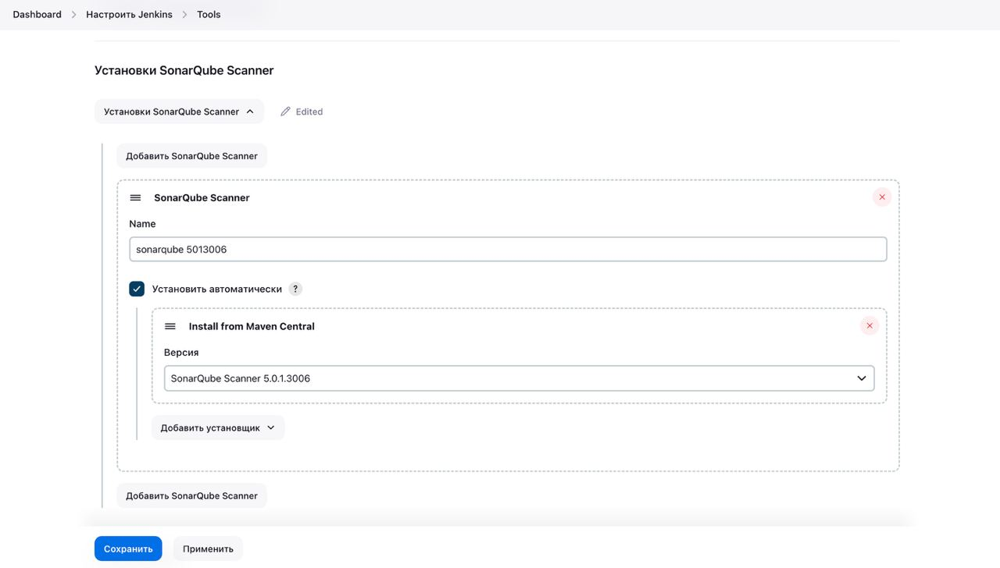

Настройки Sonarqube в Jenkins.
IP-адрес получил с помощью команды `ifconfig`
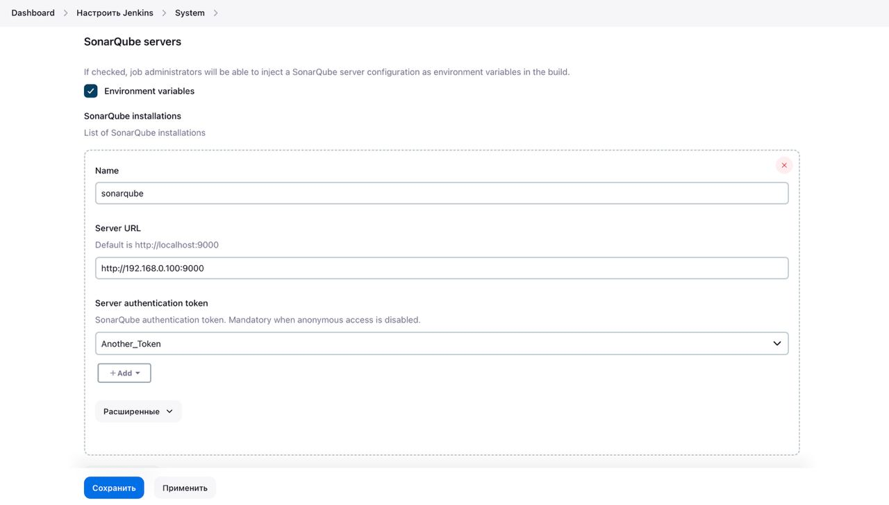

Авторизационные токены в Sonarqube.
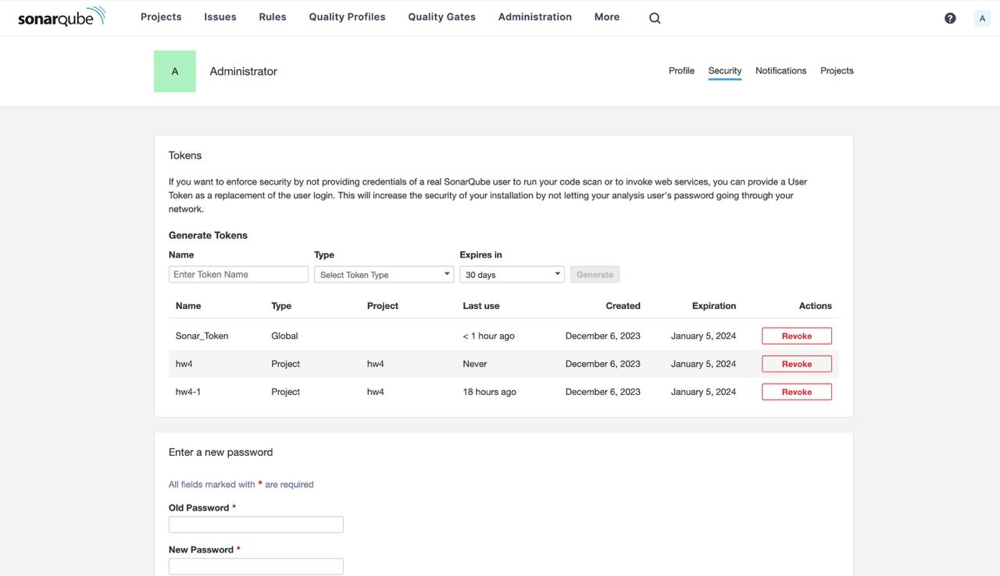

Авторизационные токены в Jenkins.
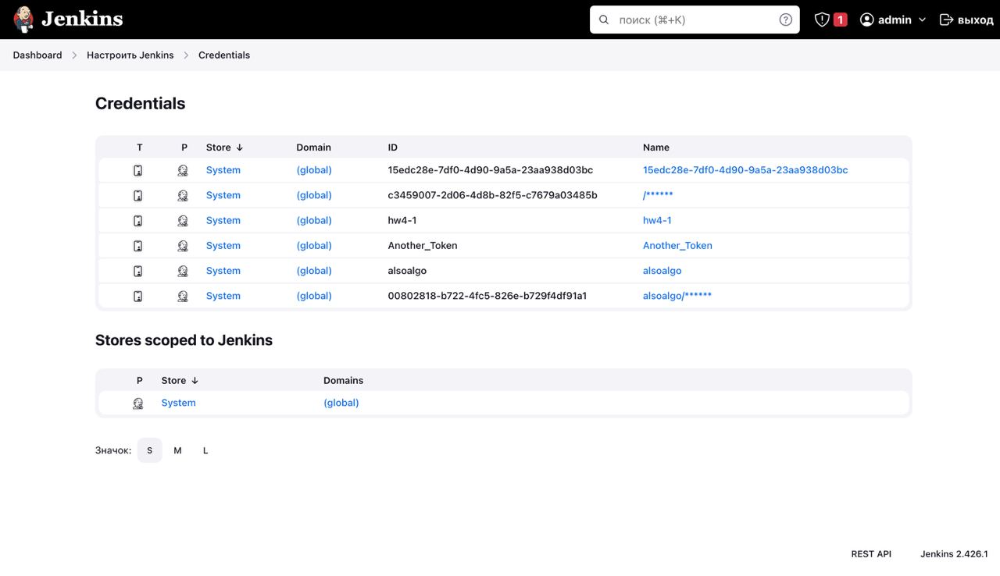

Про сам пайплайн.  
Настройка git.
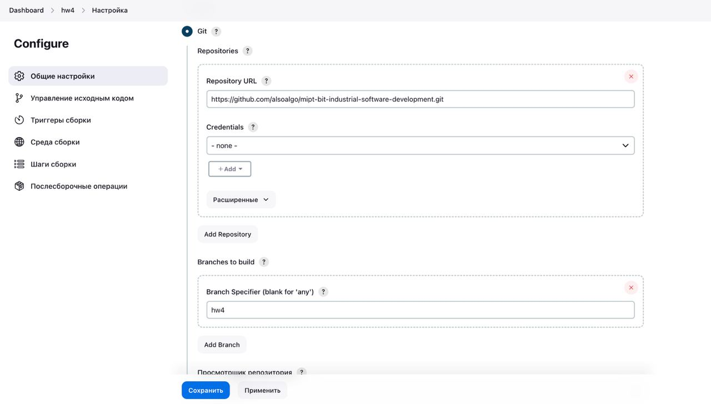

Настройка webhook'а и Sonarqube (для этого создал авторизационный токен в Sonarqube, добавил в Credentials в Jenkins).
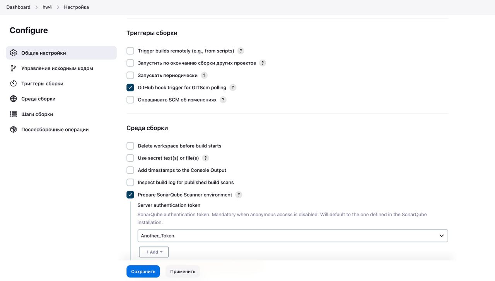  

Шаги Maven.
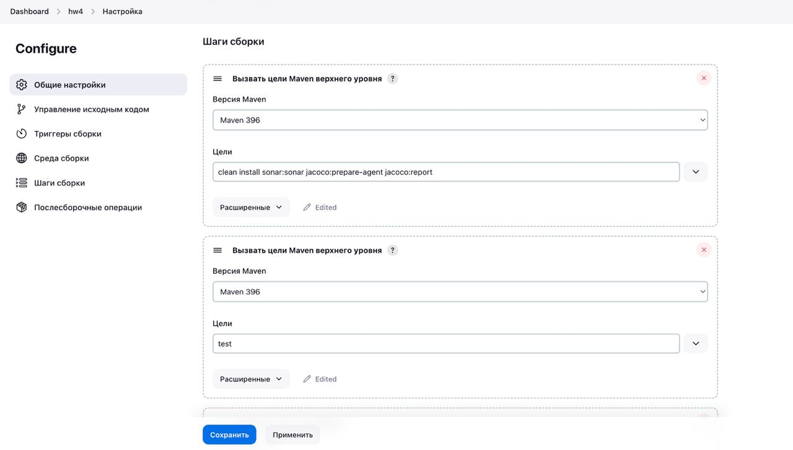

Шаг Docker.
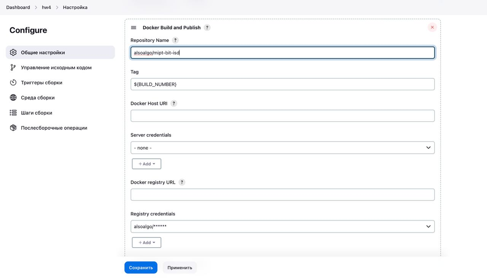

Шаг с репортом Allure.
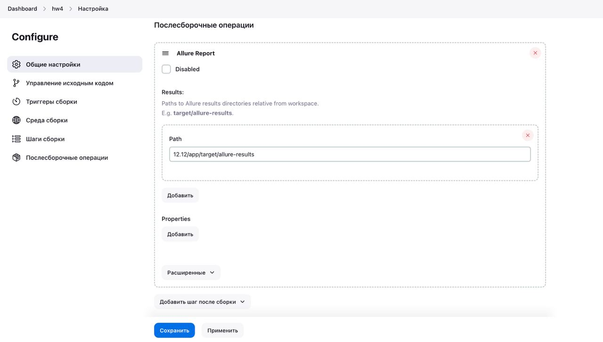

Главная страница Pipeline выглядит так.
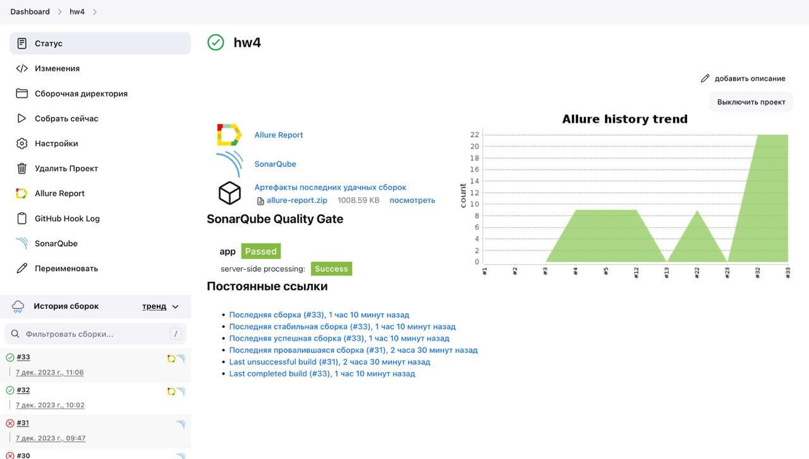

Вот добавленный hook в github.
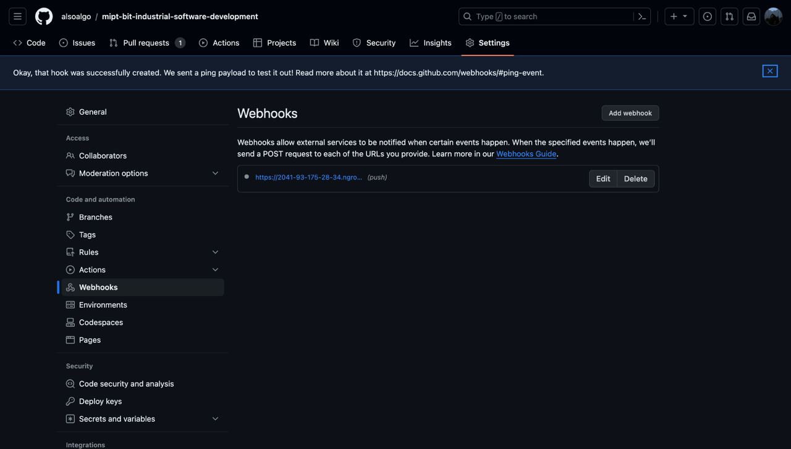

Создал hook с помощью утилиты ngrok (чтобы открыть локальный порт, сделать его публичным `ngrok http 8081`).
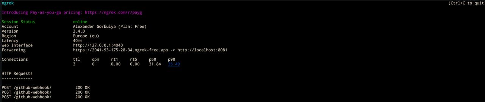

Страница Sonarqube с покрытием 90% по проекту.
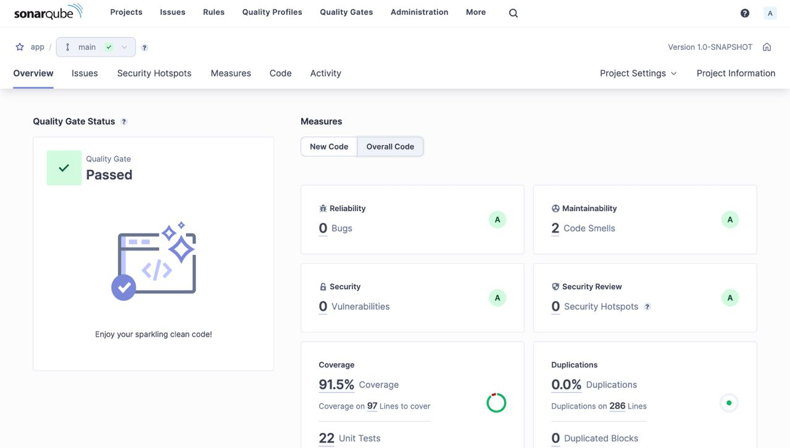

Страницы Allure, на которых видны Unit тесты и Suits.
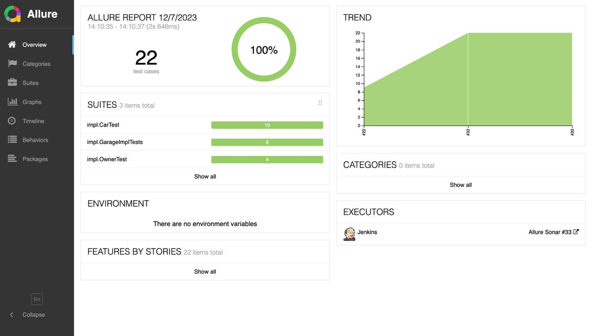
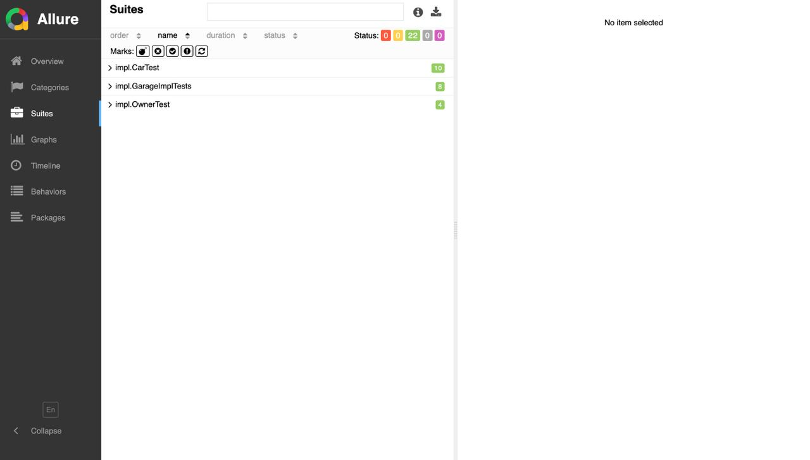